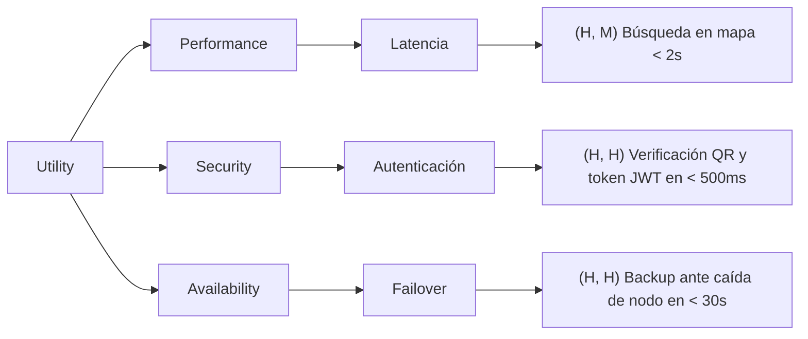

# Guía de Construcción y Priorización del Árbol de Utilidad (Utility Tree)

El **Árbol de Utilidad (Utility Tree)** es una herramienta fundamental de la metodología de arquitectura de software del SEI (utilizada en métodos como QAW y ATAM) para estructurar, refinar y priorizar los **Requerimientos Significativos para la Arquitectura (ASRs)** y Atributos de Calidad.

---

## 1. Concepto y Estructura Jerárquica

El Árbol de Utilidad traduce la meta general de "construir un buen sistema" en un conjunto priorizado de escenarios de calidad medibles y concretos.

### Niveles del Árbol:
1. **Raíz: `Utility` (Utilidad Global del Sistema)**:
   - Representa la bondad y adecuación global del sistema para todos los interesados.
2. **Nivel 1: Atributos de Calidad (Quality Attributes)**:
   - Los grandes factores de calidad arquitectónica (ej. *Performance*, *Modifiability*, *Security*, *Availability*, *Usability*, *Interoperability*).
3. **Nivel 2: Categorías / Sub-atributos (Refinement / Quality Attribute Sub-factors)**:
   - Aspectos específicos de cada atributo (ej. dentro de *Performance*: *Latencia*, *Throughput*, *Carga Pico*; dentro de *Security*: *Autenticación*, *Auditoría*, *Confidencialidad*).
4. **Nivel 3: Escenarios de Calidad (Quality Attribute Scenarios)**:
   - La especificación concreta y medible del requerimiento (con sus 6 partes resumidas en una oración o tabla).
5. **Calificación de Prioridad `(Importancia para el Negocio, Dificultad/Riesgo Arquitectónico)`**:
   - Cada hoja/escenario tiene una tupla con valores `(H, M, L)` (High, Medium, Low).

```text
                                  ┌── Latency ─────── (H, H) ─── Escenario 1: El tiempo de respuesta de búsqueda...
               ┌── Performance ───┤
               │                  └── Throughput ──── (M, L) ─── Escenario 2: El sistema debe procesar 500 tx/s...
               │
               │                  ┌── Authentication ─ (H, M) ─── Escenario 3: Tras 3 intentos fallidos de login...
Utility (Raíz) ┼── Security ──────┤
               │                  └── Audit Trail ──── (H, L) ─── Escenario 4: Toda modificación de tarifas queda...
               │
               │                  ┌── Failover ─────── (H, H) ─── Escenario 5: Si el servidor principal cae...
               └── Availability ──┤
                                  └── Network Outage ─ (M, M) ─── Escenario 6: Si se pierde la conexión GPS...
```

---

## 2. Matriz de Priorización Bidimensional `(Importancia, Dificultad)`

Para cada escenario se asignan dos dimensiones evaluadas en la escala **High (H)**, **Medium (M)**, **Low (L)**:

| Dimensión | Evaluador Típico | Qué Mide |
| :--- | :--- | :--- |
| **Importancia para el Negocio (Business Importance)** | Product Owner, Stakeholders, Clientes, Negocio | ¿Qué tan crítico es este escenario para el éxito del producto y la satisfacción del usuario? |
| **Dificultad Técnica / Riesgo Arquitectónico (Architectural Difficulty / Risk)** | Arquitecto de Software, Tech Leads, Dev Team | ¿Qué tan complejo o riesgoso es diseñar e implementar una arquitectura que cumpla con este escenario? |

### Foco de la Arquitectura:
- **`(H, H)`**: **Prioridad Máxima / Architectural Drivers primarios**. Deben ser el foco central de las tácticas y patrones arquitectónicos iniciales.
- **`(H, M)` y `(M, H)`**: Prioridad Secundaria. Deben ser diseñados y tenidos en cuenta en las primeras iteraciones.
- **`(M, M)`, `(H, L)`**: Prioridad Media. Se implementan con patrones estándar o frameworks existentes.
- **`(L, L)`, `(L, M)`**: Baja prioridad. No deberían condicionar decisiones estructurales mayores.

---

## 3. Notación en Markdown y Mermaid

### Formato en Tabla Markdown (Estándar en Informes):
| Atributo de Calidad | Sub-factor | Prioridad (Imp, Dif) | Escenario de Calidad (Resumen Medible) |
| :--- | :--- | :---: | :--- |
| **Disponibilidad** | Caída de Procesador | `(H, H)` | Si el procesador principal falla en operación normal, el sistema realiza failover al procesador backup en menos de 30 segundos sin pérdida de transacciones. |
| **Performance** | Latencia de Búsqueda | `(H, M)` | Un usuario realiza una búsqueda de monopatines cercanos bajo carga pico (500 req/s), y el mapa se renderiza con los resultados en menos de 2 segundos. |

### Formato Diagrama Mermaid (Visual):

